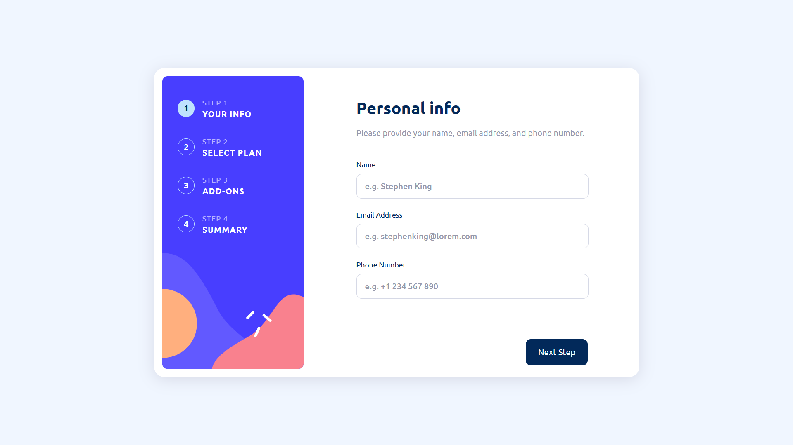

# Frontend Mentor - Multi-step form solution

This is a solution to the [Multi-step form challenge on Frontend Mentor](https://www.frontendmentor.io/challenges/multistep-form-YVAnSdqQBJ). Frontend Mentor challenges help you improve your coding skills by building realistic projects. 

## Table of contents

- [Overview](#overview)
  - [The challenge](#the-challenge)
  - [Screenshot](#screenshot)
  - [Links](#links)
- [My process](#my-process)
  - [Built with](#built-with)
  - [What I learned](#what-i-learned)
  - [Continued development](#continued-development)
  - [Useful resources](#useful-resources)
- [Author](#author)
- [Acknowledgments](#acknowledgments)

**Note: Delete this note and update the table of contents based on what sections you keep.**

## Overview

### The challenge

Users should be able to:

- Complete each step of the sequence ✅
- See a summary of their selections on the final step and confirm their order ✅
- View the optimal layout for the interface depending on their device's screen size ❌ (not yet!)
- See hover and focus states for all interactive elements on the page ✅(may not be completely done with this!)

### Screenshot



### Links

- Solution URL: [Add solution URL here](https://your-solution-url.com)
- Live Site URL: [Add live site URL here](https://your-live-site-url.com)

## My process

### Built with

- Semantic HTML5 markup
- Flexbox
- CSS Grid (may or may not use this in the mobile development)
- SASS
- Vanilla JS 🍦

### What I learned

I actually just completed my `JavaScript 2023: Zero to Mastery Course` and I was looking for the perfect project to practice on, and this turned out to be the perfect one. I really like this function which was very useful in my being able to implement the slider in the multi-step form.

To see how you can add code snippets, see below:

```js
function goToSlide(slide) {
  slides.forEach((s, i) => {
    s.style.transform = `translateX(${100 * (i - slide)}%)`;
    s.classList.remove("active-slide");

    if (s.style.transform === `translateX(0%)`) {
      s.classList.add("active-slide");
      if (s.classList.contains("active-slide")) {
        s.querySelector("form")?.insertAdjacentHTML(
          "beforeend",
          `
      <div class="lower-btns" id="lower-btns">
        <a href="#" onClick = "prevSlide()">Go Back</a>
        <button type="submit">Next Step</button>
        </div>
        `
        );
      }
    }
  });
}

```

### Continued development

In future projects I want to work more with APIs, improve my algorithm scripting and learn frameworks like React ⚛️ && Vue ✌🏿

**Note: Delete this note and the content within this section and replace with your own plans for continued development.**

### Useful resources

FreeCodeCamp, StackOverflow and ChatGPT were really helpful in my development process.

## Author

- LinkedIn - [Adeola Badero](https://www.linkedin.com/in/adeola-badero-012a611b4/)
- - Frontend Mentor - [@adex-hub](https://www.frontendmentor.io/profile/adex-hub)
- Twitter - [@Ade_the_great](https://www.twitter.com/Ade_the_great)
